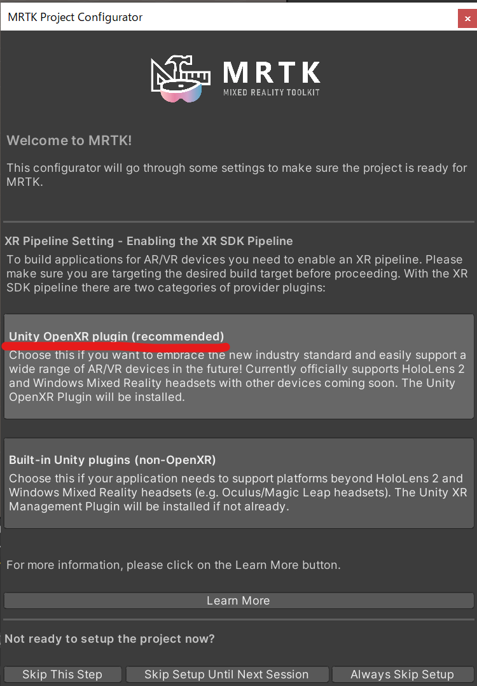
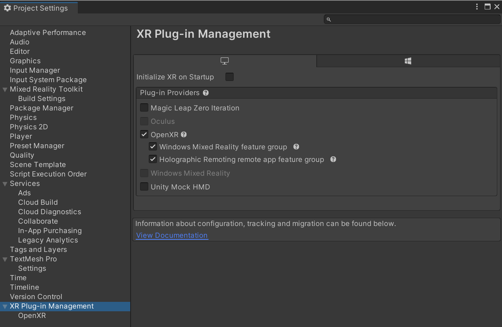
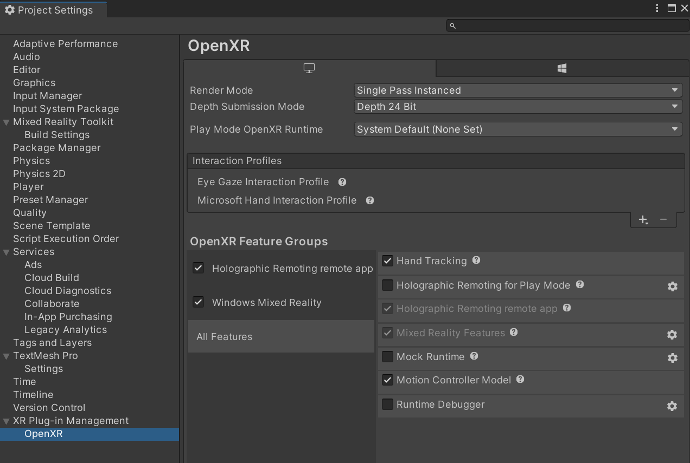
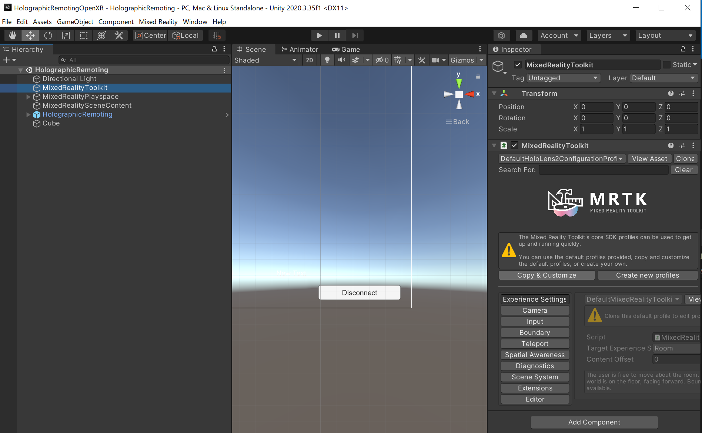

# HolographicRemotingOpenXR
- Unity 2020.3.35f1
- MixedRealityToolkit 2.8.0

# MRTK導入
- MixedRealityFeatureToolから以下をUnityプロジェクトにインポート
    - Mixed Reality Toolkit Foundation 2.8.0
    - Mixed Reality Toolkit Standardassets 2.8.0
    - Mixed Reality OpenXR Plugin 1.4.1

- MRTKの設定からOpenXRを選択
    

# Unityプロジェクト設定
- `Build Serrings` の `Platform` は `Windows Standalone` を選択
- `Player Settings` の `XR Plug-in Management` を以下のように設定
    
    

# Unity Scene設定
- HoloLens 2アプリと同様に `MixedRealityToolkit`のシーン設定を行う
- HolographicRemoting用に `HolographicRemoting` プレハブをシーンに追加
- 
